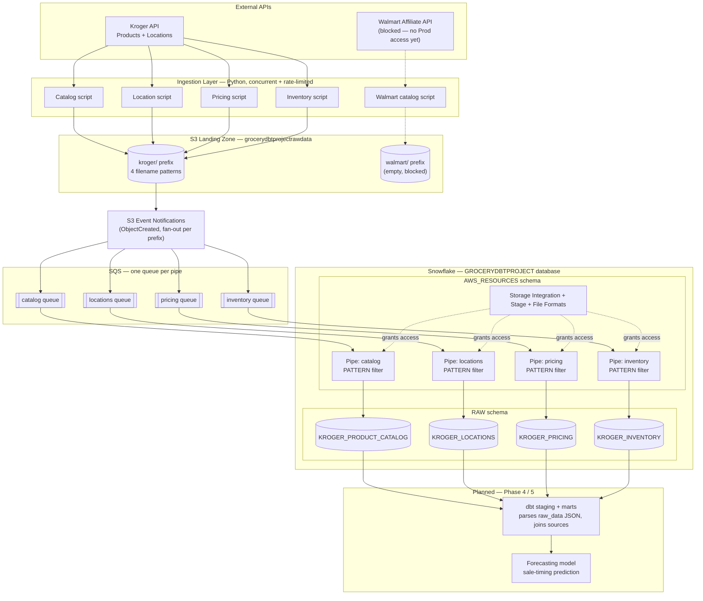

# Project Architecture

**GroceryPriceProject (SalePredictor)** — a data pipeline that collects grocery pricing, inventory, and store-location data from Kroger and Walmart, lands it in Snowflake via event-driven ingestion, and (in later phases) transforms it with dbt to forecast when items will go on sale.

## Data Flow

## How It Works

**Ingestion.** Four Python scripts pull from Kroger's Products and Locations APIs: one for the full product catalog (crawled by search term, since Kroger exposes no bulk "list everything" endpoint), one for store locations (searched by region — e.g. Metro Atlanta by ZIP + radius), and two for per-store pricing and inventory (batched by known product ID, 50 IDs/call, against a target list of store `locationId`s). All four use the same pattern: a thread pool for concurrent requests, a shared rate limiter, and a daily call-budget guard, since Kroger caps usage at 10,000 calls/day. A parallel Walmart catalog script exists but is currently blocked — the Walmart developer account only has a Stage API credential, and provisioning a Production one is stuck on a portal bug.

**Landing zone.** Every script uploads its output as a timestamped CSV directly to S3 (`grocerydbtprojectrawdata`), under a `kroger/` or `walmart/` prefix. Deliberately, the ingestion scripts apply minimal transformation: the catalog script flattens Kroger's product JSON into named columns (its shape is wide and relatively stable), but the location, pricing, and inventory scripts do the opposite — they extract only the join keys needed downstream (`productId`, `locationId`, `region`, `collected_at`) and preserve the rest of each API response untouched as a JSON string in a `raw_data` column. This is a deliberate ELT choice: parsing, joining, and business logic belong in dbt, not in the ingestion layer, so the raw layer stays a faithful, replayable copy of what the API actually returned.

**Event-driven load into Snowflake.** Rather than polling, loading is push-driven: an S3 `ObjectCreated` event fires whenever a script uploads a new file, and Snowflake's Snowpipe picks it up automatically — typically within about a minute, with no manual `COPY INTO` required. The nuance is that all four Kroger file types land in the *same* `kroger/` prefix, and each Snowpipe (`AUTO_INGEST` pipe) provisions its own dedicated SQS queue. So the S3 bucket is configured to fan the same event out to all four queues, and each pipe's own `COPY INTO ... PATTERN` clause (matching on filename, e.g. `.*kroger_pricing_.*\.csv`) decides whether that particular file is actually its concern. One shared stage and file format serve all four pipes; only the `PATTERN` differs.

**Snowflake object layout.** Everything AWS-facing — the storage integration, the shared stage, file formats, and the four pipes — lives in the `AWS_RESOURCES` schema. The landing tables themselves live in `RAW`. Access from Snowflake to S3 goes through an IAM role (`GroceryPriceProjectSnowflakeRole`) whose trust policy is scoped to Snowflake's specific IAM user and an external ID, both generated when the storage integration is created — a two-way handshake configured once and left alone, since recreating the integration invalidates it.

**What's not built yet.** There's no scheduler — every script currently runs manually, so the pipeline is push-driven for *loading* but not yet for *collection*. dbt hasn't been started: today the `RAW` tables are the end of the line, with `raw_data` sitting as unparsed JSON text. Walmart's entire pipeline is blocked upstream at the API-access stage, so `walmart/` remains empty and its Snowpipe has nothing to load. The forecasting model itself (Phase 5) is not yet designed — it depends on having enough historical pricing snapshots accumulated in `KROGER_PRICING` to detect sale patterns, which in turn depends on this pipeline actually running on a recurring schedule rather than ad hoc.

**Why this shape.** The core bet is that an event-driven, source-per-table landing pattern scales cleanly as more data types and retailers are added — each new source is a new script, a new pipe with its own `PATTERN`, and a new `RAW` table, without touching what already works. Keeping the landing layer close to raw (rather than pre-joining or reshaping in Python) means schema decisions and business logic live in one place — dbt — instead of being split across ingestion code and transformation code where they're easy to lose track of.
