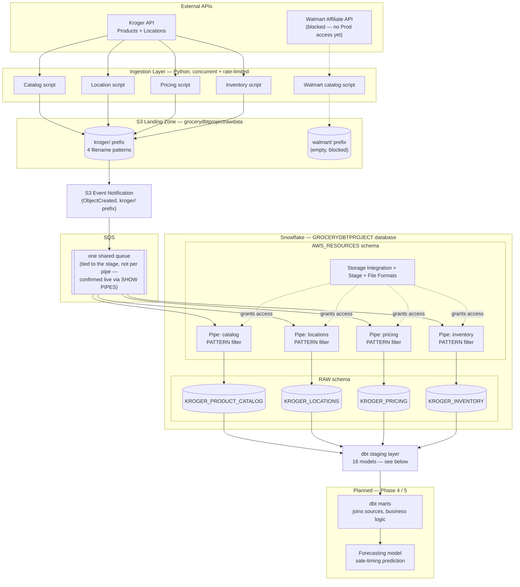
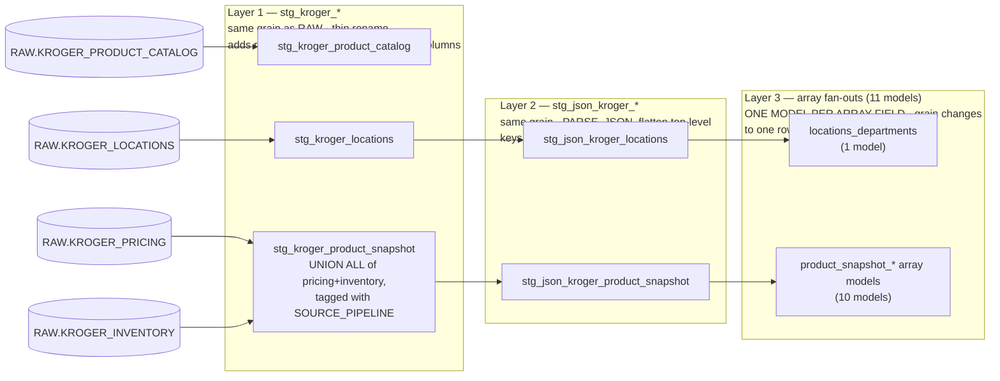
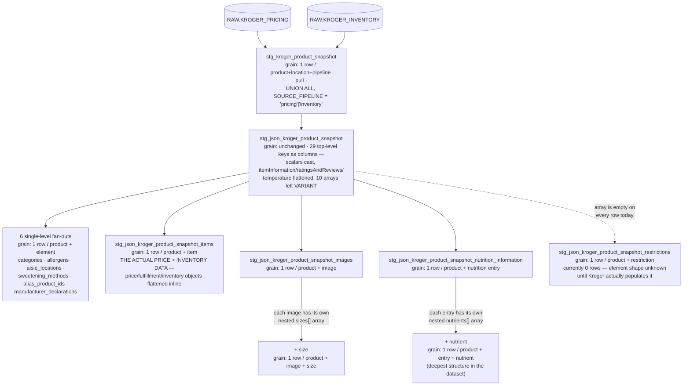

# Project Architecture

**GroceryPriceProject (SalePredictor)** — a data pipeline that collects grocery pricing, inventory, and store-location data from Kroger and Walmart, lands it in Snowflake via event-driven ingestion, and (in later phases) transforms it with dbt to forecast when items will go on sale.

## Data Flow

## How It Works

**Ingestion.** Four Python scripts pull from Kroger's Products and Locations APIs: one for the full product catalog (crawled by search term, since Kroger exposes no bulk "list everything" endpoint), one for store locations (searched by region — e.g. Metro Atlanta by ZIP + radius), and two for per-store pricing and inventory (batched by known product ID, 50 IDs/call, against a target list of store `locationId`s). All four use the same pattern: a thread pool for concurrent requests, a shared rate limiter, and a daily call-budget guard, since Kroger caps usage at 10,000 calls/day. A parallel Walmart catalog script exists but is currently blocked — the Walmart developer account only has a Stage API credential, and provisioning a Production one is stuck on a portal bug.

**Landing zone.** Every script uploads its output as a timestamped CSV directly to S3 (`grocerydbtprojectrawdata`), under a `kroger/` or `walmart/` prefix. Deliberately, the ingestion scripts apply minimal transformation: the catalog script flattens Kroger's product JSON into named columns (its shape is wide and relatively stable), but the location, pricing, and inventory scripts do the opposite — they extract only the join keys needed downstream (`productId`, `locationId`, `region`, `collected_at`) and preserve the rest of each API response untouched as a JSON string in a `raw_data` column. This is a deliberate ELT choice: parsing, joining, and business logic belong in dbt, not in the ingestion layer, so the raw layer stays a faithful, replayable copy of what the API actually returned.

**Event-driven load into Snowflake.** Rather than polling, loading is push-driven: an S3 `ObjectCreated` event fires whenever a script uploads a new file, and Snowflake's Snowpipe picks it up automatically — typically within about a minute, with no manual `COPY INTO` required. All four Kroger file types land in the *same* `kroger/` prefix and share the *same* stage — and, confirmed by directly comparing `SHOW PIPES` output across all four pipes, they also share a single SQS queue (the notification channel is tied to the stage, not to each individual pipe, contrary to an earlier assumption). So only one S3 Event Notification registration is needed; each pipe's own `COPY INTO ... PATTERN` clause (matching on filename, e.g. `.*kroger_pricing_.*\.csv`) is what actually decides whether a given file is its concern.

**Snowflake object layout.** Everything AWS-facing — the storage integration, the shared stage, file formats, and the four pipes — lives in the `AWS_RESOURCES` schema. The landing tables themselves live in `RAW`. Access from Snowflake to S3 goes through an IAM role (`GroceryPriceProjectSnowflakeRole`) whose trust policy is scoped to Snowflake's specific IAM user and an external ID, both generated when the storage integration is created — a two-way handshake configured once and left alone, since recreating the integration invalidates it.

**What's not built yet.** This section predates the Aldi/Publix integration and the Orchestration pipeline (both 2026-08-23) — see `.claude/instructions.md` and `Orchestration/README.md` for current state; not rewritten fully here yet. As of 2026-08-23, Kroger and Aldi run on a real weekly schedule (EventBridge Scheduler + Fargate, see `Orchestration/README.md`) — collection is no longer purely manual for those two sources, though `dbt run` after each collection still is. dbt's Kroger staging layer (below) is fully built, plus an intermediate layer collapsing it into actual price history — but marts, the layer that joins catalog/pricing/inventory/location together and applies business logic, still doesn't exist. Walmart's entire pipeline is blocked upstream at the API-access stage, so `walmart/` remains empty and its Snowpipe has nothing to load. The forecasting model itself (Phase 5) is not yet designed — it depends on enough historical pricing snapshots accumulating in `KROGER_PRICING`, which the new schedule is now actually building toward instead of relying on ad hoc runs.

**Why this shape.** The core bet is that an event-driven, source-per-table landing pattern scales cleanly as more data types and retailers are added — each new source is a new script, a new pipe with its own `PATTERN`, and a new `RAW` table, without touching what already works. Keeping the landing layer close to raw (rather than pre-joining or reshaping in Python) means schema decisions and business logic live in one place — dbt — instead of being split across ingestion code and transformation code where they're easy to lose track of.

## Kroger Staging Layer (dbt)

`RAW.KROGER_LOCATIONS`, `KROGER_PRICING`, and `KROGER_INVENTORY` each store their Kroger API response as a `raw_data` JSON column, mostly untouched (per the raw-landing convention above). Getting from that to usable columns takes three distinct layers, not one big flatten — because "parse JSON into columns" and "explode an array into its own rows" are fundamentally different operations with different risk profiles, and collapsing them together would make it hard to trust what grain you're actually querying at.

**Pricing and inventory are one model family, not two.** `Kroger_Pricing_*.py` and `Kroger_Inventory_*.py` both call the identical `/v1/products` endpoint and land the identical raw response (see the NOTE in `Kroger_Pricing_*.py`) — the two RAW tables differ only in *which script* collected each row, not in shape or content. Every downstream staging model built on top of them was therefore a byte-for-byte duplicate, just pointed at a different source table: 24 of the original 28 staging models existed purely because of this split. They've been consolidated into `stg_kroger_product_snapshot` (`UNION ALL` of both RAW tables, tagged with a `SOURCE_PIPELINE` column so provenance isn't lost) and everything downstream of it, cutting the Kroger staging layer from 28 models to 16 with no loss of grain or data.

`KROGER_PRODUCT_CATALOG` stops at Layer 1 — it was already flattened into named columns at ingestion time (its shape is wide but stable, unlike the other three), so there's no `raw_data` to parse and no Layer 2/3 for it.

**Why three layers, not one.** Layer 1 stays deliberately trivial — one-to-one with `RAW`, easy to eyeball against the source, nothing to get wrong. Layer 2 introduces real structure (JSON keys become typed columns) but is still guaranteed to be exactly one row per `RAW` row, because parsing an object's fields doesn't change how many objects there are. Layer 3 is where that guarantee breaks: exploding an array means a product with 8 nutrients produces 8 rows, each repeating every non-nutrient column — a materially different, easier-to-misuse shape than Layer 2. Keeping it as separate, explicitly-named models means anyone querying `stg_json_kroger_product_snapshot` can trust it's still one row per product+pipeline pull, and anyone who needs item- or nutrient-level detail has to deliberately opt into that grain by querying `stg_json_kroger_product_snapshot_items` or `..._nutrition_information` instead.

The product-snapshot pipeline shows the reasoning most clearly, since two of its ten arrays (`images`, `nutrition_information`) have their *own* nested array inside every element, requiring a second fan-out on top of the first:

**How the exact shape was determined.** Every key and grain decision above came from querying the live data directly (`OBJECT_KEYS` unioned across every row via `LATERAL FLATTEN`), not from reading one sample response and assuming it generalized. That caught real surprises a single example would have missed: `promoPerUnitEstimate`/`regularPerUnitEstimate` turned out to be plain numbers, not nested objects as their names might suggest; most department records are just `{departmentId, name}`, but some (e.g. an off-site Pharmacy) also carry their own `address`/`geolocation`/`hours`/`offsite` fields other departments don't have.
